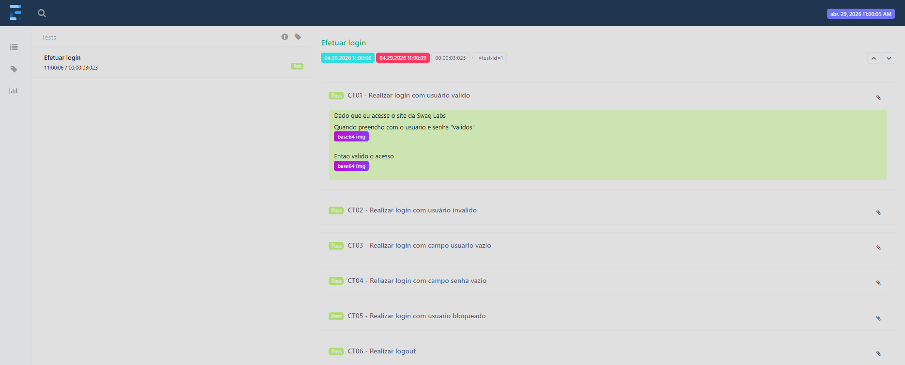

# Swag-Labs-Web-Test-Automation

Projeto de automação de testes Web do site [Swag Labs](https://www.saucedemo.com) com o intuito de aprimorar meus conhecimentos utilizando as tecnologias e ferramentas de automação

 

## Pré Requisitos (Instalação)
- Maven
- JDK 1.8+
- Eclipse
- Cucumber (Eclipse Plugin)

## Como Executar os Testes
- Na pasta src/test/java dentro no pacote feature encontram-se as features
- Abrir o arquivo da feature desejada
- Copiar a tag da funcionalidade ou a tag do cenário desejado
- Abrir o arquivo Runner.java na pasta src/test/java pacote util
- Adicionar tag desejada no @CucumberOptions tags = "@Login"
- Executar o Runner.java com o JUnit

## Relatório de testes
Após executar os testes com o JUnit, o relatório contendo as execuções e prints de evidencias será salvo como Spark.html na pasta target/ExtentReport. Clicar no CT para expandir, e ao clicar no botão base64 img abaixo de cada step será aberta a imagem contendo a evidência.

Exemplo do relatório:

